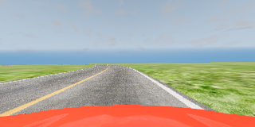

#  BeamNG Dataset

This dataset contains the BeamNG dataset used in the paper "Bridging the Gap between Real-world and Synthetic Images for Testing Autonomous Driving Systems". The dataset is used for the lane keeping task using the BeamNG ADS. `ds_beamng.csv` contains the paths to the images and the corresponding steering angles captured from the BeamNG simulator.

