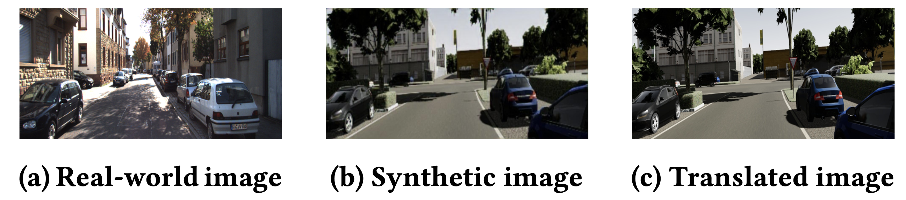

# Bridging the Gap between Real-world and Synthetic Images for Testing Autonomous Driving Systems

This repository contains the code and datasets used in the paper "Bridging the Gap between Real-world and Synthetic Images for Testing Autonomous Driving Systems". The paper addresses the problem of existing gap between real-world and synthetic images in the context of testing autonomous driving systems (ADS).



## Abstract

Deep Neural Networks (DNNs) for Autonomous Driving Systems (ADS) are typically trained on real-world images and tested using synthetic images from simulators. This approach results in training and test datasets with dissimilar distributions, which can potentially lead to erroneously decreased test accuracy. To address this issue, the deep learning literature suggests applying domain-to-domain translators to test datasets to bring them closer to the training datasets. However, translating images used for testing may unpredictably affect the reliability, effectiveness and efficiency of the testing process.  Hence, this paper investigates the following questions in the context of ADS: *Could translators reduce the effectiveness of  images used for ADS-DNN testing and their ability to reveal faults in ADS-DNNs? Can translators result in excessive time overhead during simulation-based testing?* To address these questions, we consider three domain-to-domain translators: CycleGAN and neural style transfer, both widely used in the  literature, and SAEVAE, our proposed translator.  Our results for two critical ADS tasks -- lane keeping and object detection -- indicate that translators significantly narrow the gap in ADS test accuracy caused by distribution dissimilarities between training and test data, with SAEVAE outperforming the other two translators. We  show that, based on the recent diversity, coverage, and fault-revealing ability metrics for testing deep-learning systems, translators do *not* compromise the diversity and the coverage of test data  *nor* do they lead to revealing fewer faults in ADS-DNNs. Furthermore, among the three translators considered, SAEVAE incurs a negligible overhead in simulation time and can be efficiently integrated into simulation-based testing. Finally, we observe that translators increase the correlation between offline and simulation-based testing results, which can help reduce the cost of simulation-based testing. We have provided our complete replication package online.

## Folder Structure

```bash
.
├── data
└── scripts
```

- `data`: Contains the BeamNG dataset used in the paper.
- `scripts`: Contains the scripts used to generate the results in the paper.

## Datasets

- `ds_beamng`: Dataset for lane keeping task using the BeamNG ADS.
- `udacity`: Public dataset for lane keeping task using the Udacity ADS (link in the paper).
- `KITTI`: Public dataset for object detection task (link in the paper).
- `vKITTI`: Public dataset for object detection task (link in the paper).

## Scripts

This folder contains the scripts for reproducing the results in the paper.

##  Simulations
In this paper, we utilized the BeamNG simulator for all experiments, following the setup provided by the SBFT competition. Detailed instructions on how to run this setup are available in the SBFT GitHub repository [Link](https://github.com/sbft-cps-tool-competition/cps-tool-competition).

## License

This project is licensed under the MIT License - see the [LICENSE](./LICENSE) file for details.


## Citation

If you use this code or the datasets in your research, please cite the following paper:

```
@inproceedings{amini_ase2024,
title = {Bridging the Gap between Real-world and Synthetic Images for Testing Autonomous Driving Systems},
authors = {Mohammad Hossein Amini, Shiva Nejati},
booktitle = {Internation Conference on Automated Software Engineering (ASE)},
year = {2024},
}
```
