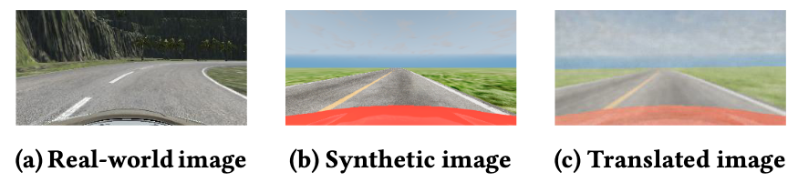

# Bridging the Gap between Real-world and Synthetic Images for Testing Autonomous Driving Systems

This repository contains the code and datasets used in the paper "Bridging the Gap between Real-world and Synthetic Images for Testing Autonomous Driving Systems". The paper addresses the problem of existing gap between real-world and synthetic images in the context of testing autonomous driving systems (ADS). We propose a novel testing setup to mitigate this gap by leveraging deep learning methods.



## Abstract

Deep Neural Networks (DNNs) are integral to Autonomous Driving Systems (ADS). Typically, DNNs for ADS are trained using data from sensor-equipped vehicles and are tested in both offline and online settings. Offline testing evaluates ADS-DNNs using static datasets, whereas online testing assesses their effectiveness in a closed-loop setup. A challenge arises when the training and test datasets have dissimilar distributions, which is often the case with real-world images compared to simulator-generated, i.e., synthetic, images. Such discrepancies can lead to inaccurate assessments of ADS-DNNs in both offline and online testing, compromising the effectiveness of our quality assurance methods for ADS-DNNs.  This paper introduces SAEVAE, a novel image-to-image translator that transforms synthetic images into representations more reflective of real-world conditions, thereby bridging the gap between real-world and simulator-generated images.  SAEVAE overcomes the limitations of baseline techniques by ensuring efficient translation times and eliminating the need for image pairing.
Our results for two critical ADS tasks -- lane keeping and object detection -- indicate that SAEVAE significantly reduces the gap between real-world and synthetic images and  significantly outperforms  baseline translators based on CycleGAN and neural transfer methods. Specifically,  on average, SAEVAE narrows the accuracy gap by up to 57% in offline testing and by up to 80% in online testing. 
Further, incorporating SAEVAE into the closed loop of the simulator and ADS-DNN for online testing  results in a mere 8\% average increase in simulation time, making it  an effective solution for improving the realism of online testing while incurring minimal time overhead.

## Folder Structure

```bash
.
├── data
└── scripts
```

- `data`: Contains the BeamNG dataset used in the paper.
- `scripts`: Contains the scripts used to generate the results in the paper.

## Datasets

- `ds_beamng`: Dataset for lane keeping task using the BeamNG ADS.
- `udacity`: Public dataset for lane keeping task using the Udacity ADS (link in the paper).
- `KITTI`: Public dataset for object detection task (link in the paper).
- `vKITTI`: Public dataset for object detection task (link in the paper).

## Scripts

This folder contains the scripts for reproducing the results in the paper.

## Citation

If you use this code or the datasets in your research, please cite the following paper:

```
@inproceedings{amini_ase2024,
title = {Bridging the Gap between Real-world and Synthetic Images for Testing Autonomous Driving Systems},
authors = {Mohammad Hossein Amini, Shiva Nejati},
booktitle = {Internation Conference on Automated Software Engineering (ASE)},
year = {2024},
}
```
